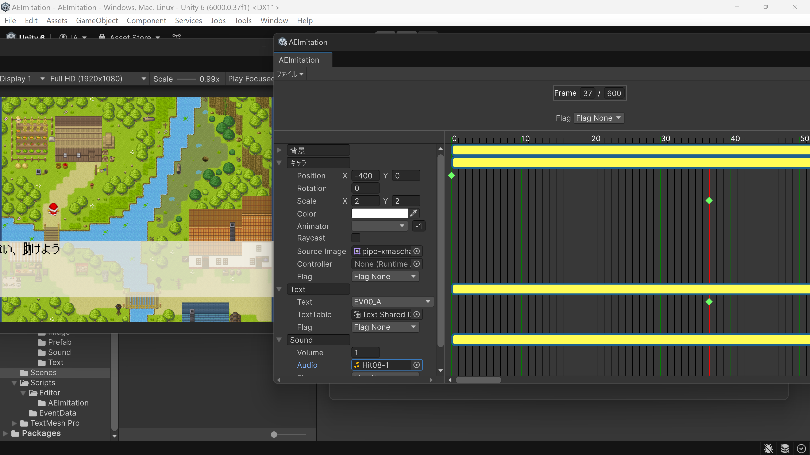

# AEImitation
  
unityで動作する2Dイベント作成用のエディタです。  
Timeline機能の劣化版です。  
UIToolkitで作成しています。  

## 動作環境
unity version: 6000.0.37f1

## サンプル
1. Tools→AEImitationを選択  
2. AEImitationウィンドウのファイル→開くを選択  
3. ./Sample/Event/Event.xmlを選択  
4. Unityの再生を実行  
 
## 素材提供
画像：[ぴぽや](https://pipoya.net/)  
フォント:[8×12ドット日本語フォント「k8x12」](https://littlelimit.net/k8x12.htm)  
音源:[OtoLogic](https://otologic.jp)  
